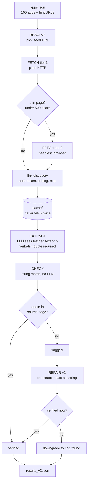

# App research agent — Composio take-home

Researches 100 apps from their own documentation and reports, per app: auth
methods, access tier, API surface, MCP availability, and a buildability verdict
— each backed by a verbatim quote from a page the agent actually fetched.

**Live page:** https://anusha-2817.github.io/composio-app-research/

## The core rule

No field may come from model memory.

Every value is extracted only from text fetched from a real URL. If the fetched
text doesn't say it, the value is `not_found`. Every non-null field carries a
verbatim `evidence_snippet`, and a separate stage string-matches that snippet
against the cached source. A quote that isn't in the page is a fabrication, and
it gets flagged mechanically — no LLM, no judgement call.

This caught **34 fabricated citations** across 594 fields on the first pass.

## Pipeline

| Stage | What it does | LLM? |
|---|---|---|
| Resolve | Pick a seed URL from the app's hint | no |
| Fetch | HTTP, then headless browser if the page is thin; follow up to 5 same-domain links matching auth/token/pricing/mcp keywords; cache everything to disk | no |
| Extract | Fill the schema from fetched text only, with a verbatim quote per field | yes |
| Check | String-match every quote against its source page | no |
| Repair (v2) | Re-extract flagged fields; downgrade to `not_found` if they fail twice | yes |

Full design notes and the schema live in [`SPEC.md`](SPEC.md), including a
"design decisions" section recording which observed failure drove each change.

## Architecture



## Running it

```bash
pip install -r requirements.txt
playwright install chromium

# key goes in .env, not the shell
echo "GEMINI_API_KEY=your-key-here" > .env

python fetch_pipeline.py                    # all 100 apps, writes cache/
python extract_pipeline.py                  # writes results_v1.json
python check_pipeline.py                    # writes verification_report.json
python repair_v2.py                         # writes results_v2.json
python score.py                             # v2 vs hand-researched gold set
python patterns.py                          # distributions and cross-tabs
```

Single app, for a quick check:

```bash
python extract_pipeline.py --apps "DealCloud" --show "DealCloud"
```

Fetches are cached to `cache/` keyed by URL hash, so re-runs are cheap and the
same page is never fetched twice.

**The cache is committed, so CHECK is reproducible without a network.**
`cache/*.json` holds the extracted page text — the exact strings every
`evidence_snippet` is matched against, and all `check_pipeline.py` reads. Clone
the repo and re-run verification offline; every citation in the results can be
confirmed or falsified against these files.

The raw HTML alongside it (`cache/*_raw.html`, ~480 MB) is **not** committed. It
is the input to text extraction, not to verification, so excluding it costs
nothing for checking claims and keeps the repo to a few MB. Re-running
`fetch_pipeline.py` regenerates it.

## Files

| File | What's in it |
|---|---|
| `SPEC.md` | Schema, pipeline design, and why each design decision was made |
| `apps.json` | The 100 apps with their hint URLs |
| `gold_set.json` | 7 apps researched by hand, no AI — the scoring baseline |
| `results_v1.json` | First pass, kept untouched for comparison |
| `results_v2.json` | After the repair loop |
| `verification_report*.json` | Per-field verdicts for v1 and v2 |
| `index.html` | The findings page (built by `build_index.py`) |
| `patterns.py` | Distribution and cross-tab stats |

## Verification

Accuracy was measured two ways.

**Citation checking, all 100 apps.** Every evidence snippet is string-matched
against the page it claims to come from.

| | v1 | v2 |
|---|---|---|
| Verified | 418 / 594 (70.4%) | 443 / 594 (74.6%) |
| Flagged | 48 | 0 |

The repair loop re-extracted flagged fields with an exact-substring instruction.
25 fields were repaired; 23 that failed twice were **downgraded to `not_found`
rather than left unverified** — lower coverage, higher trust. 45 negative
assertions (`mcp: none` with no quote) were reclassified as
`unverifiable_negative`, since documentation describes what exists, not what
doesn't.

Applying a deterministic rule — if auth or access tier is unknown, buildability
cannot be asserted — moved 36 apps from a confident verdict to
`insufficient_evidence`, and dropped `easy_win` from 63 to 53.

**Gold set, 7 apps.** Researched by hand from the docs before any results were
looked at, deliberately chosen to hit unusual cases rather than to be
representative.

The sharpest finding came from running the gold set through the same citation
checker: **a human researching 7 apps visited 15 pages; the agent reached 4 of
them.** Most of the error surface is fetcher reach, not model capability.

## Where a human was needed

- **Schema design.** Three apps were researched by hand first, specifically to
  break the schema before committing to it. Every unusual enum value —
  `per_tenant`, `customer_admin_gated`, `wrong_shape`, `unverifiable_negative` —
  came from something that broke during that probe.
- **Judging what's worth fixing.** The agent will happily chase the most broken
  app in front of it. Deciding that a dead domain is a finished result, not a
  bug, was a human call made repeatedly.
- **Catching confident wrong output.** While researching Sherlock, link
  discovery pulled `github.com/pricing` — real pages, genuine quotes, wrong
  entity. The citation checker cannot catch this, because the quote is real.
  A human reading the output caught it.
- **Distrusting the summary, not just the data.** The MCP pass reported 70 apps
  without a server. The real number was 58 — its list tracked apps this pass
  couldn't help, which included 12 that already had a verified server. Diffing
  the two files caught it before publication. The data was never wrong; the
  summary printed on top of it was.

## Known limitations

- **The fetcher reaches API reference docs and little else.** MCP pages,
  pricing, and partner terms live on adjacent pages that reference docs don't
  link to. This explains the missed MCP servers, and the 20% `not_found` rate on
  access tier.
- **Support and Helpdesk failed 8 of 10** on auth and buildability while every
  other category came back mixed. A category-shaped blind spot, found but not
  diagnosed.
- **Name collisions defeat both agent and human.** Otter.ai (transcription) and
  tryotter.com (restaurant software) are different companies. Both got confused
  during hand research.
- **Negative findings are structurally unverifiable.** No page states that an
  app has no MCP server, so "none" can never be verified by citation.
- **7 gold apps is a thin sample.** Enough to name specific failure modes, not
  enough for tight per-field precision estimates.
- **Nine repair-loop fields were downgraded due to API rate limits**, not
  because the evidence was bad. Conservative, but it understates coverage.

## Model

Extraction used Gemini 3.1 Flash Lite with native structured output, pinned
to a single model id for both runs so the v1 → v2 delta measures the pipeline
and not the model. The hard part here is retrieval and verification, not
generation, so a fast cheap model is the right choice — and the citation checker
catches it when it's wrong.